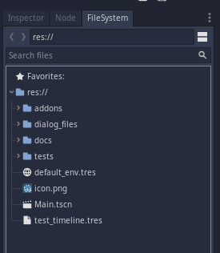
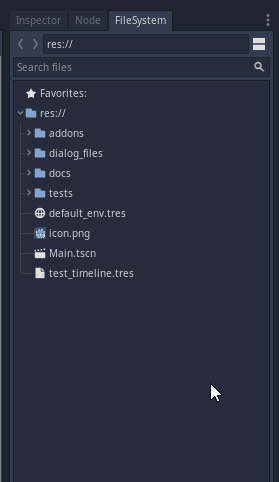
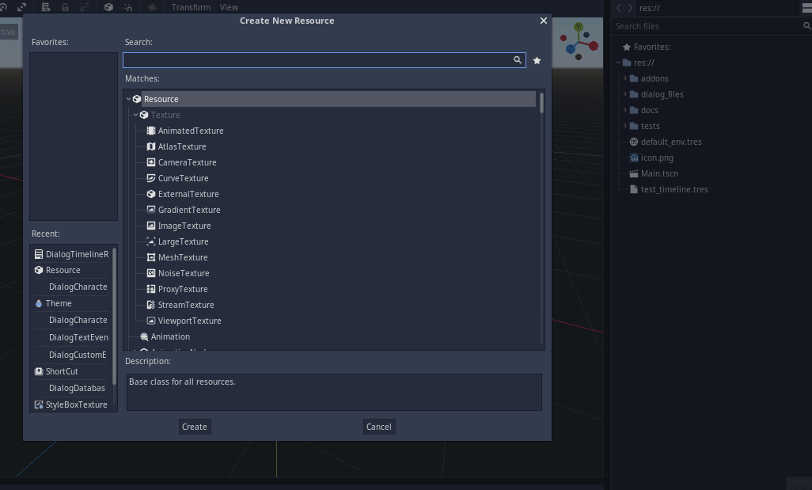
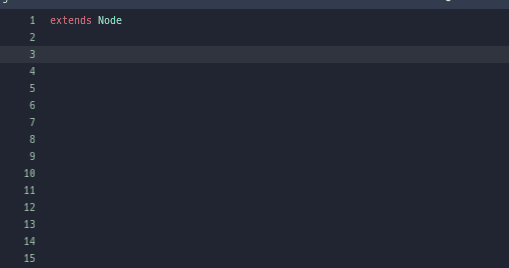

# Creating a Timeline


The plugin must be activated.


## Creating a timeline through the editor

* Go to FileSystem tab.



* Right click and click on `New Resource`.



* Select `DialogTimelineResource` and save it whetever you want.



## Creating a timeline through code

Create a `DialogTimelineResource` resource and assign it to a variable to use it.

```swift
var timeline = DialogTimelineResource.new()
```



