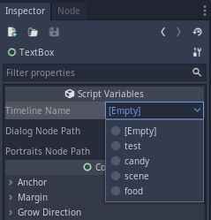

# Using the Timeline in Game

## 🔵 Create it from code:

```swift
# ...
# inside any node in the scene
# ...

# Create the node first and start it with your timeline
var dialog_node = Dialog.start(<your_timeline>)

# Add that node to the scene
add_child(dialog_node)
```

`<your_timeline>` can be:

* The name of your timeline \(the name that you used when you created it\), 
* The absolute path \(something like `res://dialog_files/timelines/<your_timeline>.tres`\) to that timeline,
* A `DialogTimelineResource`.

## 🔵 Instantiate it in the scene through the editor:


Then, select the node:


And, inside the Inspector tab, select the timeline:



That's it, it's fair simple.


> For now, there's only 3 events. They'll be more, and you can create your custom events if you want.

