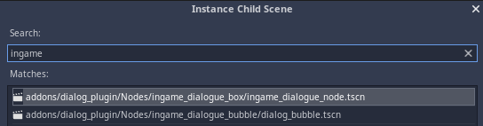
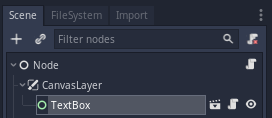
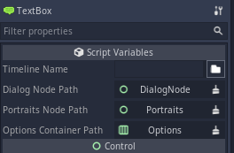

# Using the Timeline in Game

## 🔵 Create it from code:

```swift
# ...
# inside any node in the scene
# ...

# Create the node first and start it with your timeline
var dialog_node = Dialog.start(<your_timeline>)

# Add that node to the scene
add_child(dialog_node)
```

`<your_timeline>` can be: 

* The absolute path \(something like `res://<your_timeline>.tres`\) to that timeline,
* A `DialogTimelineResource`.

Or you can set the timeline resource directly

```swift
<DialogBaseNode>.timeline = <Your_Timeline_Resource>
<DialogBaseNode>.start_timeline()
```


## 🔵 Instantiate it in the scene through the editor:



Then, select the node:



And, inside the Inspector tab, select the timeline:



That's it, it's fair simple.

